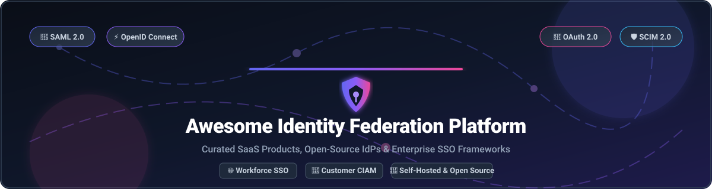

  

  
  
  
  
  

# 🌐 Awesome Identity Federation Platform

> **A curated showcase of premier SaaS Identity Cloud Platforms and Open-Source Identity & Access Management (IAM) infrastructure.**
> 
> *Comprehensive guide for workforce SSO, customer identity (CIAM), SAML 2.0, OpenID Connect (OIDC), OAuth 2.0, and zero-trust identity brokering.*

---

## 📌 Table of Contents

- [☁️ SaaS & Enterprise Cloud Identity Platforms](#️-saas--enterprise-cloud-identity-platforms)
- [🔓 Open-Source Identity & Access Management Projects](#-open-source-identity--access-management-projects)
- [🛠️ Architectural Selection Guide](#️-architectural-selection-guide)
- [🤝 How to Contribute](#-how-to-contribute)
- [💖 Support & Sponsorship](#-support--sponsorship)
- [📈 Star History](#-star-history)
- [⚠️ Disclaimer](#️-disclaimer)

---

## ☁️ SaaS & Enterprise Cloud Identity Platforms

> 📊 **Sector Market Size & Structure**: The global **Identity & Access Management (IAM)** and **Identity Federation** market is estimated at **~$16.5 Billion (2026)** and projected to reach **~$32 Billion by 2030**. The enterprise workforce identity market is **moderately concentrated** (led by Microsoft Entra ID and Okta), while the Customer Identity (CIAM) and developer authentication segment is **highly fragmented** with strong competition between specialized cloud providers and open-source stacks.

Below is a comparison of leading enterprise SaaS Identity platforms, ranked by **Company Size / Market Valuation (Descending)**:

| 🏢 Platform | 💡 Key Capabilities & Focus | 💰 Starting Price | 🎁 Free Tier / Trial Limits | 📊 Company Size / Valuation |
| :--- | :--- | :--- | :--- | :--- |
| **[Microsoft Entra ID](https://www.microsoft.com/en-us/security/business/identity-access/microsoft-entra-id)** | Enterprise cloud directory, workforce SSO, conditional access, and cross-cloud identity governance. | **$6.00 / user / month** (Entra ID P1) | **Free plan included** (Up to 500,000 directory objects; 50,000 MAUs for External Identities) | **~$3.3 Trillion Market Cap** (Microsoft) |
| **[Oracle OCI IAM](https://www.oracle.com/security/identity-management/)** | Cloud-native enterprise identity lifecycle, SSO, SAML federation, and Oracle Cloud infrastructure integration. | **$2.25 / user / month** (IAM Premium) | **Free plan included** (2,000 free IAM users & 50,000 MAUs for External Identities) | **~$380 Billion Market Cap** (Oracle Corp) |
| **[IBM Security Verify](https://www.ibm.com/products/verify-identity)** | Enterprise hybrid identity management, risk-based adaptive MFA, and deep compliance auditing. | **$1.88 / user / month** (Verify SaaS SSO) | **30-day free trial** (Full access for up to 100 users and 5 target applications) | **~$200 Billion Market Cap** (IBM) |
| **[Okta Workforce Identity](https://www.okta.com/)** | Industry-standard workforce identity cloud with 7,000+ pre-built application integrations and universal directory. | **$2.00 / user / month** (Single Sign-On starter) | **Developer Free Edition** (Free forever for up to 100 workforce active users) | **~$13 Billion Market Cap** (Okta Inc) |
| **[Ping Identity & ForgeRock](https://www.pingidentity.com/)** | High-scale enterprise hybrid IAM, legacy web access management, and complex identity federation engines. | **$3.00 / user / month** (PingOne Essential) | **30-day free trial** (Unlimited test users & up to 5 enterprise connections) | **~$5.1 Billion Valuation** (Thoma Bravo) |
| **[Auth0 (by Okta)](https://auth0.com/)** | Developer-centric CIAM platform supporting rapid social login, passwordless auth, and custom extensibility rules. | **$35.00 / month** (B2C Essentials, 500 MAUs) | **Free plan included** (Free forever for up to 7,400 MAUs & 2 social IdPs) | **~$3.2 Billion Valuation** (Acquired by Okta) |
| **[OneLogin](https://www.onelogin.com/)** | Cloud Identity platform offering streamlined workforce SSO, SmartFactor MFA, and directory integration. | **$2.00 / user / month** (Advanced SSO) | **30-day free trial** (Full feature access for up to 25 users) | **~$1.5 Billion Valuation** (One Identity / Quest) |
| **[WSO2 Asgardeo](https://wso2.com/asgardeo/)** | Cloud-native Customer IAM (CIAM) SaaS built on WSO2 standards with low-code developer SDKs. | **$50.00 / month** (Business Plan) | **Free plan included** (Free forever for up to 1,000 MAUs & 5 app integrations) | **~$600 Million Valuation** (WSO2 / EQT) |

---

## 🔓 Open-Source Identity & Access Management Projects

Below is a curated list of production-grade **Open-Source Identity Providers**, ranked by **GitHub Star Count (Descending)**. Star badges link directly to each project's stargazers page:

1. 👑 **[Keycloak](https://github.com/keycloak/keycloak)**   
   Leading CNCF open-source identity and access management solution. Features Single Sign-On (SSO), identity brokering, LDAP/AD user federation, SAML 2.0, OpenID Connect, and fine-grained authorization.

2. 🛡️ **[Authelia](https://github.com/authelia/authelia)**   
   Lightweight authentication and authorization server providing two-factor authentication (2FA) and single sign-on for applications running behind reverse proxies (Nginx, Traefik, Caddy).

3. 🔑 **[Authentik](https://github.com/goauthentik/authentik)**   
   Modern open-source Identity Provider focused on flexibility and visual pipeline builders. Supports SAML 2.0, OIDC, LDAP, RADIUS, embedded reverse proxying, and custom Python authentication flows.

4. ⚡ **[SuperTokens](https://github.com/supertokens/supertokens-core)**   
   Developer-first open-source Auth0 alternative for web and mobile apps. Provides modular components for passwordless login, social SSO, multi-tenancy, and secure session management.

5. 🏢 **[Zitadel](https://github.com/zitadel/zitadel)**   
   Cloud-native identity infrastructure written in Go. Built for multi-tenant B2B applications, fine-grained access control, audit immutability, and turn-key OIDC/SAML integration.

6. 🎨 **[Logto](https://github.com/logto-io/logto)**   
   Modern open-source identity engine with pre-built UI sign-in components, multi-tenant RBAC, and streamlined developer workflows for Customer Identity (CIAM).

7. 🚀 **[Casdoor](https://github.com/casdoor/casdoor)**   
   UI-first open-source Identity and Access Management (IAM) / Single Sign-On (SSO) platform supporting OAuth 2.0, OIDC, SAML, and CAS protocols with multi-language web UI support.

8. ⚙️ **[Ory Kratos](https://github.com/ory/kratos)**   
   API-first, headless cloud-native user management and identity provider engine. Integrates seamlessly with Ory Hydra for OAuth2/OIDC standards and zero-trust microservices architectures.

9. 🎓 **[Apereo CAS](https://github.com/apereo/cas)**   
   Enterprise single sign-on framework heavily used in higher education and enterprise orgs, supporting Central Authentication Service (CAS) protocol, SAML 2.0, OpenID Connect, and OAuth 2.0.

10. 🦀 **[Kanidm](https://github.com/kanidm/kanidm)**   
    High-performance, memory-safe identity management server written in Rust. Designed for Linux enterprise directory replacement, SSH key management, and OAuth2/OIDC web SSO.

11. 🌐 **[WSO2 Identity Server](https://github.com/wso2/product-is)**   
    Enterprise-grade open-source IAM platform offering adaptive authentication, identity federation across multi-cloud environments, API security, and privacy compliance.

12. 📦 **[Janssen Project (Gluu evolution)](https://github.com/JanssenProject/jans)**   
    Linux Foundation open-source digital identity platform designed for high-concurrency identity governance, OAuth 2.0 authorization, and FIDO2 passwordless authentication.

13. 🐧 **[FreeIPA](https://www.freeipa.org/)**  
    Integrated open-source identity management solution for Unix/Linux environments, combining Linux directory services, 389 Directory Server, Kerberos, DNS, and Certificate Management (PKI).

14. 🍋 **[LemonLDAP::NG](https://lemonldap-ng.org/)**  
    Enterprise WebSSO and reverse-proxy access management software supporting SAML 2.0, OpenID Connect, CAS, and fine-grained authorization rules.

---

## 🛠️ Architectural Selection Guide

- 🏛️ **Enterprise Workforce SSO**: Standardize on **Keycloak** or **Authentik** for self-hosted sovereign clouds, or **Microsoft Entra ID** / **Okta** for extensive pre-built SaaS app catalogs and managed compliance.
- 💻 **API-First & Headless CIAM**: Deploy **Ory (Kratos + Hydra)** or **Zitadel** when building multi-tenant SaaS products requiring custom UI rendering and modern REST/gRPC identity APIs.
- 🔐 **Zero-Trust Reverse Proxy Auth**: Use **Authelia** or **Authentik** to enforce 2FA/MFA in front of internal infrastructure dashboards without modifying downstream application source code.
- 🌍 **Data Sovereignty & Air-Gapped Deployments**: Open-source solutions (**Keycloak**, **Kanidm**, **Casdoor**) eliminate per-user SaaS license costs and keep user credentials strictly within private data centers.

---

## 🤝 How to Contribute

Contributions are warmly welcomed! To suggest a new Identity Federation platform or update existing information:

1. 🍴 Fork the repository.
2. 📝 Add or edit entries in `README.md` following the tabular or badged structure.
3. 🔗 Verify official documentation links, pricing models, and open-source star badges.
4. 🚀 Submit a Pull Request with a brief note explaining your proposed additions.

Please review our curated resources list at **[Awesome-Awesome-Awesome](https://github.com/ishandutta2007/Awesome-Awesome-Awesome)** for related repository guidelines.

---

## 💖 Support & Sponsorship

If you find this identity federation directory helpful for your security team, platform architecture, or research, please consider supporting the project:

- ⭐ **Star this repository** to help others discover it.
- 🔀 **Fork & Share** with your team and security network.
- ☕ **Buy me a coffee / Sponsor**: Support ongoing maintenance via the [GitHub Sponsor Dashboard](https://github.com/sponsors/ishandutta2007).

Thank you to all community contributors and maintainers for keeping identity standards open, secure, and accessible!

---

## 📈 Star History

---

## ⚠️ Disclaimer

- This repository is a **community-curated list** provided for educational and informational purposes only.
- Identity and access control platforms are **security-critical infrastructure**. Deploying open-source or SaaS identity providers requires rigorous threat modeling, secrets hardening, regular security patching, and compliance verification.
